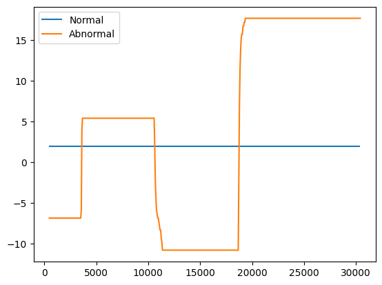
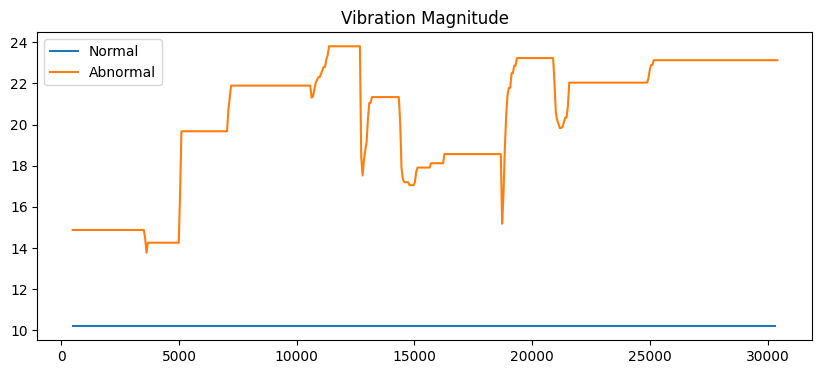
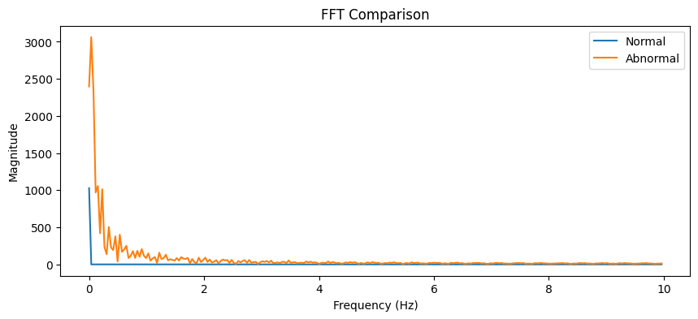

# 🔧 Vibration Anomaly Detection using ESP32 & MPU6050

## 📌 Overview

This project detects abnormal vibrations using the MPU6050 sensor and ESP32. The collected data is analyzed using Python to identify anomalies in machine behavior.

---

## ⚙️ Components Used

* ESP32
* MPU6050 (Accelerometer + Gyroscope)
* Wokwi Simulator
* Python (Google Colab)

---

## 🛠️ Methodology

1. Simulated MPU6050 using Wokwi
2. Collected two datasets:

   * Normal vibration
   * Abnormal vibration
3. Stored data in CSV format
4. Analyzed data using Python:

   * Time-domain plots
   * Vibration magnitude
   * FFT (Frequency analysis)
   * RMS calculation

---

## 📊 Results

* Normal signal → smooth variation
* Abnormal signal → spikes and noise
* FFT → higher peaks in abnormal condition
* RMS → higher for abnormal vibration

---

## 📊 Visualization

### Time Domain

### Vibration Magnitude

### Frequency Analysis (FFT)

## 📁 Files

* `normal.csv` → Normal vibration data
* `abnormal.csv` → Abnormal vibration data
* `analysis.ipynb` → Python analysis code
* `esp32_code.ino` → ESP32 sensor code
* `time_plot.png → Time-domain comparison of normal vs abnormal vibration
* `magnitude_plot.png → Combined vibration magnitude analysis
* `fft_plot.png → Frequency-domain (FFT) analysis showing vibration differences

---

## 🚀 Conclusion

This project demonstrates how vibration signals can be used to detect faults in machines using signal processing techniques.

---

## 🔮 Future Improvements

* Add machine learning for automatic classification
* Use real hardware instead of simulation
* Build real-time monitoring system
